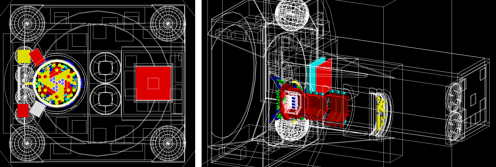

# Geant4_SPI

                                PIMP - Post-launch INTEGRAL Mass Model Package
                                                ----------


Authors: Maxime Chauvin
based on code developed by Dave Willis and Dave Clark.

## 1 - INTRODUCTION

Geant4_Spi is a Geant4 application for the instrument response simulation of 
the SPectrometer on-board Integral (SPI). The whole Integral satellite is 
modeled but only SPI is modeled in details.

## 2 - GEOMETRY DEFINITION

The geometry is build from ...(to be completed)

## 3 - PHYSICS LIST

The physics list contains the following PhysicsList classes as Geant4 
modular physics list with registered physics builders provided in Geant4:
```c++
// EM physics
RegisterPhysics(new G4EmLivermorePhysics());

// Decay
RegisterPhysics(new G4DecayPhysics());

// Radioactive decay
RegisterPhysics(new G4RadioactiveDecayPhysics());
```

## 4 - SOURCE

The particles are generated from ...(to be completed)

## 5 - SCORER AND OUTPUT

Energy deposits are scored inside the germanium detectors ...(to be completed)

The simulation ouput a fits file which provides ...(to be completed)

## 6 - PSEUDO RANDOM GENERATOR

...(to be completed)

## A - VISUALISATION

The visualization manager is set via the G4VisExecutive class in the main() 
function of PIMP.cc.

The initialisation of the drawing is done via a set of /vis/ commands in the 
macro mac/vis.mac. This macro is automatically read from the main function when 
the application is run in interactive mode.

The tracks are drawn at the end of each event, accumulated for 
all events and erased at the beginning of the next run.

## B - HOW TO BUILD

Dependencies: cfitsio https://heasarc.gsfc.nasa.gov/docs/software/fitsio/fitsio.html
- on linux `apt install libcfitsio-dev`
- on MacOS `brew install cfitsio`

You need to have the G4 environment variables set up in your terminal session. 
If it is not done in your .bashrc or .profile you need to do this first 
with your own Geant4 install path:
```bash
source /usr/share/geant4/geant4-install/bin/geant4.sh
```
Create a build directory, and inside it run:
```bash
cmake ../
make
```

## C - HOW TO RUN

Execute PIMP in interactive mode with visualization:
```
./PIMP
```

Execute PIMP in batch mode (without visualization):
```
./PIMP CygX1_Odeg.fits 1234 PointSource 50000000 0 0 83.63320833 22.01447222 0 1.36087 151.667 0.584414
```
